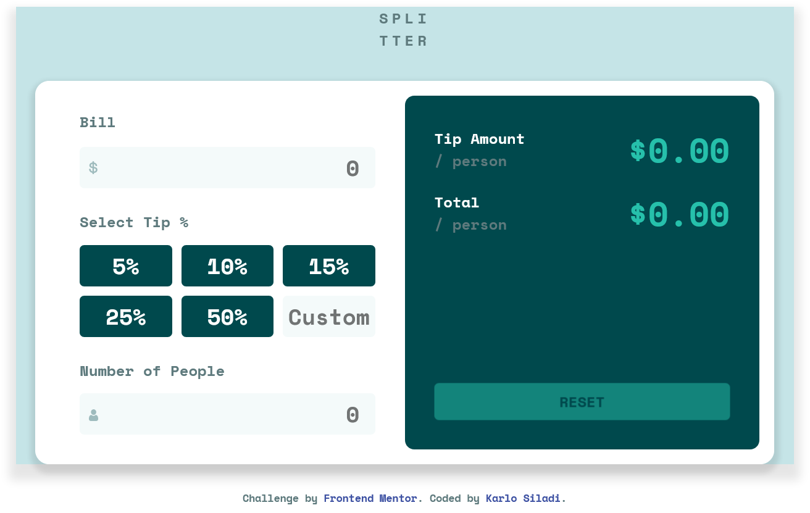
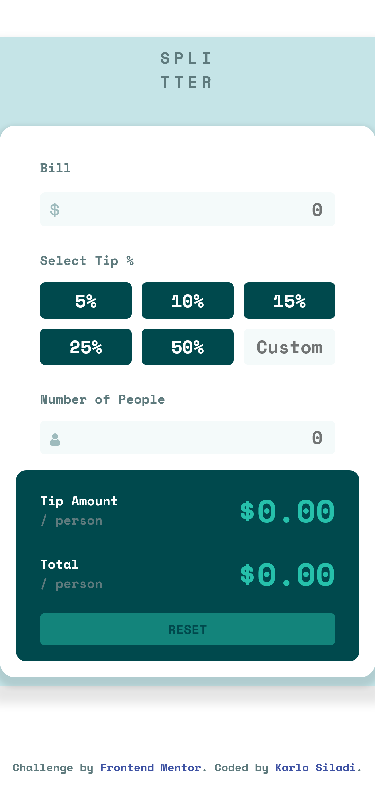

# Frontend Mentor - Tip calculator app solution

This is a solution to the [Tip calculator app challenge on Frontend Mentor](https://www.frontendmentor.io/challenges/tip-calculator-app-ugJNGbJUX). Frontend Mentor challenges help you improve your coding skills by building realistic projects.

## Table of contents

- [Overview](#overview)
  - [The challenge](#the-challenge)
  - [Screenshot](#screenshot)
  - [Links](#links)
- [My process](#my-process)
  - [Built with](#built-with)
  - [What I learned](#what-i-learned)
  - [Continued development](#continued-development)
  - [Useful resources](#useful-resources)
- [Author](#author)
- [Acknowledgments](#acknowledgments)

## Overview

### The challenge

Users should be able to:

- View the optimal layout for the app depending on their device's screen size
- See hover states for all interactive elements on the page
- Calculate the correct tip and total cost of the bill per person

### Screenshot

#### Desktop view



#### Mobile view



### Links

- Solution URL: [https://github.com/siladikarlo856/frontendmentor-tip-calculator-app](https://github.com/siladikarlo856/frontendmentor-tip-calculator-app)
- Live Site URL: [https://siladikarlo856.github.io/frontendmentor-tip-calculator-app/](https://siladikarlo856.github.io/frontendmentor-tip-calculator-app/)

## My process

### Built with

- Semantic HTML5 markup
- CSS custom properties
- Flexbox
- CSS Grid
- Responsive design
- Vanilla JavaScript

### What I learned

I learned how to add custom outline color on text input field:

```css
.input-text:active,
.input-text:focus {
  outline-color: var(--strong-cyan);
}
```

I learnd how to make a button that stays selected after you click on it. For that I used element id which can be determined on user click event.

```js
function tipValueUpdate(e) {
    const id = e.target.id;
    switch(id) {
        case "fivePercentTip":
            selectedTip = 5;
            unselectAll();
            fivePercentTipBtn.classList.add("tip-btn-selected");
    ...
}

// event listeber
fivePercentTipBtn.addEventListener('click', tipValueUpdate);
```

I learned how to get value from the input text field after user change it. For that I used 'change' event listener and value can be read using e.target.value.

```js
function totalBillUpdate(e) {
  billValue = parseFloat(e.target.value);
}

// Event listener
billValueEl.addEventListener("change", totalBillUpdate);
```

I learned how to take care of different datatypes and how to round up numbers to be able to show it on UI.

### Continued development

For future updates I will refactor this project using SCSS and one of frontend frameworks (React, Angular,...)

### Useful resources

- [HTMLElement: change event](https://developer.mozilla.org/en-US/docs/Web/API/HTMLElement/change_event) - This helped me to figure out how to grab user input value on change event
- [JavaScript Switch Statement](https://www.w3schools.com/js/js_switch.asp) - This one helped me to write DRY code.
- [typeof operator](https://developer.mozilla.org/en-US/docs/Web/JavaScript/Reference/Operators/typeof) - This helped me during development
- [parseInt()](https://developer.mozilla.org/en-US/docs/Web/JavaScript/Reference/Global_Objects/parseInt)
- [parseFloat()](https://developer.mozilla.org/en-US/docs/Web/JavaScript/Reference/Global_Objects/parseFloat)
- [Changing HTML Style](https://www.w3schools.com/js/js_htmldom_css.asp) - this helped me to style a HTML element from JavaScript file

## Author

- Website - [Karlo Siladi](http://karlo-siladi.from.hr/)
- Frontend Mentor - [@siladikarlo856](https://www.frontendmentor.io/profile/siladikarlo856)
- LinkedIn - [Karlo Siladi](https://www.linkedin.com/in/karlosiladi/)

## Acknowledgments

- MDN Web Docs
- W3 schools
- Kevin Powell CSS Youtube channel
